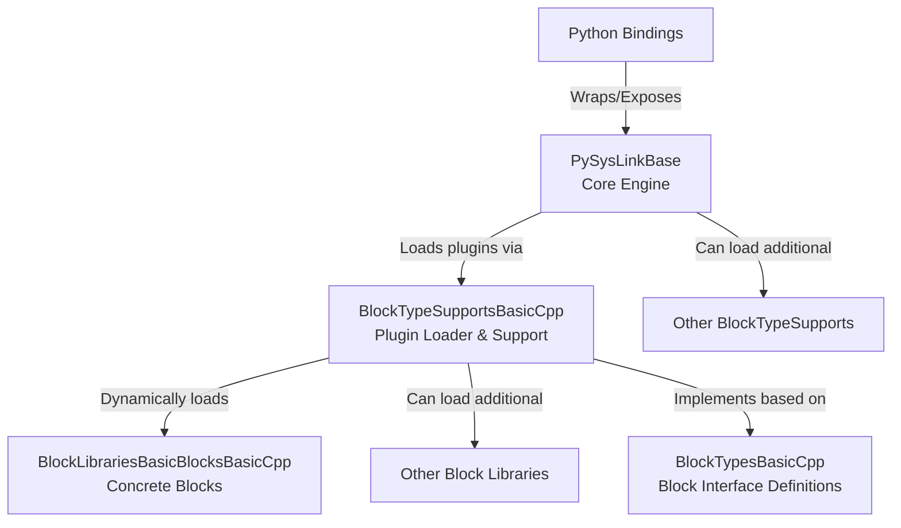

# PySysLinkBase

**PySysLinkBase** is the core simulation engine for PySysLink – an open source, Simulink‑inspired tool for modeling and simulating block diagrams. It is designed to support both discrete and continuous dynamics while remaining flexible enough to be extended via plug‑ins. PySysLinkBase provides the essential interfaces and classes that allow users to define simulation models in YAML, execute simulations, and manage inter‑block communication.

## Installation

To build and install PySysLinkBase on your system, follow these steps:

1. **Clone the Repository:**

   ```bash
   git clone https://github.com/PySysLink/PySysLinkBase.git
   cd PySysLinkBase
   ```

2. **Create a Build Directory:**

   ```bash
   mkdir build
   cd build
   ```

3. **Configure the Project with CMake:**

   ```bash
   cmake ..
   ```

4. **Build the Project:**

   ```bash
   make
   ```

5. **Install the Library:**

   (Installation typically requires superuser privileges.)

   ```bash
   sudo make install
   ```

## Building and Running Tests

To build and run the tests for PySysLinkBase:

1. Create a separate build directory (or enable tests in your current build):

   ```bash
   mkdir build_tests
   cd build_tests
   cmake -DENABLE_TESTS=ON ..
   make
   ```

2. Run the test executable:

   ```bash
   ./Tests/test_main
   ```

## Key Interfaces and Classes

To help you understand how PySysLinkBase works, here are some of the main interfaces and classes:

- **ISimulationBlock**  
  The abstract base class representing a simulation block. It defines essential methods such as:
  - `GetId()` and `GetName()`
  - `GetSampleTime()` and `SetSampleTime()`
  - `GetInputPorts()`, `GetOutputPorts()`
  - `ComputeOutputsOfBlock()`
  
- **ModelParser**  
  Responsible for reading a YAML model file and converting it into a simulation model (i.e. a network of blocks and links).

- **SimulationModel**  
  Represents the complete simulation model. It holds collections of simulation blocks and port links, and provides methods for obtaining connected blocks, ordering blocks for simulation, and propagating sample times.

- **SimulationManager**  
  Manages the simulation execution. It processes the model’s blocks over time, handles the simulation time steps, and directs the simulation workflow.

- **IBlockFactory**  
  An interface for factories that create concrete simulation blocks. This allows the simulation engine to remain decoupled from specific block implementations. Each plugin can define its own derived class of **ISimulationBlock**, and register a concrete implementation of **IBlockFactory** to create them.

- **BlockTypeSupportPluginLoader**  
  Responsible for dynamically loading plug‑ins (BlockTypeSupports) that extend the simulation engine with new block types.

- **PortsAndSignalValues (Port, InputPort, OutputPort, SignalValue, UnknownTypeSignalValue)**  
  These classes handle the signal values that flow between simulation blocks. They provide methods for value copying, cloning, and type‐identification.

- **SampleTime**  
  Manages sample time information (discrete, continuous, inherited, multirate, etc.) for simulation blocks. This is critical for synchronizing block execution during simulation.

- **SpdlogManager**  
  A helper class that configures and manages logging (using spdlog) for the simulation, helping trace and debug simulation execution.

- **ContinuousAndOde**  
  Contains classes for handling continuous state simulation and ODE integration, including:
  - **ISimulationBlockWithContinuousStates** – Subtype of **ISimulationBlock**, which includes continuous states, and methods to enable the continuous time simulation:
    - GetContinuousStates(), SetContinuousStates()
    - GetContinousStateDerivatives()
    - GetContinuousStateJacobians()
  - **EulerForwardStepSolver**, **OdeintStepSolver** – Implement different numerical integration schemes.
  - **SolverFactory** – Creates instances of ODE solvers based on configuration.


## Plug‑in Loading in PySysLinkBase

PySysLinkBase supports an extensible architecture by dynamically loading plug‑ins that provide new block type supports. The core mechanism is implemented in the `BlockTypeSupportPluginLoader` class. Here’s an overview of how it works and what you need to do to create a new plug‑in:



### How Plug‑in Loading Works

- **Scanning for Plug‑ins:**  
  The loader scans a specified directory (e.g., `/usr/local/lib`) for shared library files whose names start with `"libBlockTypeSupports"` and end with `".so"`. This filtering is done using a helper function (`FindSharedLibraries`) that also checks if a filename ends with the required suffix.

- **Loading Shared Libraries:**  
  For each matching shared library, the loader uses `dlopen` (or the Windows equivalent) to load the library into memory.

- **Retrieving Exported Functions:**  
  The plug‑in must export two functions using an extern "C" interface:
  1. **RegisterSpdlogLogger:**  
     - **Purpose:** To set up logging inside the plug‑in using the core’s logger instance.  
     - **Signature:**  
       ```cpp
       extern "C" void RegisterSpdlogLogger(std::shared_ptr<spdlog::logger> logger);
       ```
  2. **RegisterBlockFactories:**  
     - **Purpose:** To register one or more block factories provided by the plug‑in into a registry (a `std::map<std::string, std::shared_ptr<IBlockFactory>>`).  
     - **Signature:**  
       ```cpp
       extern "C" void RegisterBlockFactories(std::map<std::string, std::shared_ptr<IBlockFactory>>& registry);
       ```
  
- **Integrating the Plug‑in:**  
  After successfully loading a shared library, the loader calls:
  - `RegisterSpdlogLogger` to pass the default logger (so that the plug‑in can use the same logging configuration as the core).
  - `RegisterBlockFactories` to add the plug‑in’s block factories to the central registry.
  
- **Cleanup:**  
  Once the functions are called, the shared library handle is closed (using `dlclose`) while the registered factory objects remain available in the registry.

### What You Need to Do to Implement a New Plug‑in

If you want to create a new plug‑in for BlockTypeSupport (or a block library that extends BlockTypeSupport), follow these guidelines:

1. **Name Your Shared Library Appropriately:**  
   - The file must start with `libBlockTypeSupports` and end with `.so` (or the appropriate extension on your platform).

2. **Export the Required Functions:**  
   - **Extern "C":**  
     Use the `extern "C"` linkage specifier to prevent C++ name mangling.  
   - **Implement `RegisterSpdlogLogger`:**  
     This function should accept a `std::shared_ptr<spdlog::logger>` and store or use it as needed for logging within your plug‑in.  
   - **Implement `RegisterBlockFactories`:**  
     This function should receive a reference to a registry map. You must create one or more instances of your custom block factory (which implements `IBlockFactory`) and insert them into the map using a unique key (for example, the name of your block type).

3. **Compile as a Shared Library:**  
   - Ensure that your project is compiled as a shared library with Position‑Independent Code (PIC).
   - Link against the required dependencies (such as PySysLinkBase and any block type interfaces).

4. **Test Your Plug‑in:**  
   - Place your shared library in the designated plug‑in directory.
   - Run PySysLinkBase; the plug‑in loader will scan the directory, load your plug‑in, and register your block factories. Use logging (via spdlog) to verify that your functions are called correctly.
